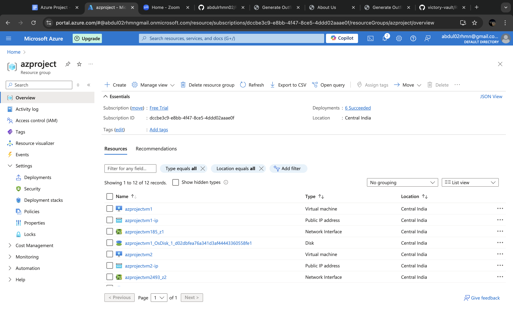

# Closet.AI – Deploying Static Website using Load Balancer by ARM Template

## Project Overview

**Closet.AI** is a website that allows users to upload images of their clothing items (such as shirts and pants) and generates multiple outfit combinations to help users decide on the best outfit for the day. The site aims to simplify the decision-making process by providing users with a visual representation of outfit combinations. 

This project demonstrates the deployment of **Closet.AI** using Azure's ARM templates and load balancing across two Virtual Machines (VMs) in different availability zones for high availability and scalability.

## Problem Statement

Selecting outfits from a wardrobe can be time-consuming and tedious. Closet.AI solves this problem by generating outfit combinations from the user's clothing uploads, providing an intuitive and user-friendly interface for decision-making. After building the website, the challenge was to deploy it on Azure using a load-balanced architecture for efficient traffic distribution.

## Project Goals

- Deploy the **Closet.AI** website on Azure using ARM templates.
- Set up a **Virtual Network (VNet)** with two **Subnets** and a **Network Security Group (NSG)**.
- Use a **Load Balancer** to distribute traffic between two VMs located in different availability zones.
- Host the static website on these VMs and make it accessible via the load balancer's frontend IP.

## Technologies and Azure Services Used

1. **Azure CLI**: Used to create the resource group and Virtual Network.
2. **ARM Templates**: Automated the creation of VNet, subnets, and NSG.
3. **Azure Virtual Machines (VMs)**: Hosted the Closet.AI website.
4. **Azure Load Balancer**: Distributed the traffic between two VMs to ensure high availability.
5. **Nginx**: Used as a web server on both VMs to serve the static content.
6. **Git**: Cloned the website from GitHub onto the VMs using a custom script.
7. **Custom Script Extension**: Used to automatically configure the VMs upon deployment.

## Project Steps

### 1. Website Development
- **Closet.AI**: A static website allowing users to upload images of clothing items, generating a variety of outfit combinations. 

### 2. Deploying the Website on GitHub
- The frontend of **Closet.AI** was uploaded to a public GitHub repository: [Frontend-Closet.AI](https://github.com/abdulrhmn02/Frontend-Closet.AI.git).

### 3. Azure Deployment Using ARM Templates
- **Resource Group**: Created using Azure CLI to hold all the resources.
- **Virtual Network (VNet)**: Set up using an ARM template, which included two subnets for distributing the VMs.
- **Network Security Group (NSG)**: Applied inbound rules to allow traffic on ports 22 (SSH) and 80 (HTTP).
  
### 4. Virtual Machines Setup
- **VM 1**: Created in Availability Zone 1 using Azure Portal. Configured with:
  - Custom Script Extension to clone the website from GitHub.
  - Networking settings to connect to the VNet and assigned Subnet.
  
  Custom Script:
  ```bash
  #!/bin/bash
  sudo apt update
  sudo apt install nginx git -y
  cd /tmp && git clone https://github.com/abdulrhmn02/Frontend-Closet.AI.git mysitee
  sudo rm -rf /var/www/html/index.nginx-debian.html
  sudo cp -r /tmp/mysitee/* /var/www/html/
  ```

- **VM 2**: Created in Availability Zone 2 with the same configuration as VM 1.

### 5. Load Balancer Configuration
- **Load Balancer**: Configured to distribute traffic between VM 1 and VM 2.
  - **Frontend IP Configuration**: Assigned a new frontend IP for external access.
  - **Backend Pool**: Added both VMs to the backend pool for traffic distribution.
  - **Load Balancing Rule**: Defined to balance HTTP traffic (port 80) across the VMs.
  - **Health Probe**: Set up to monitor the health of the VMs and ensure traffic is routed only to healthy VMs.

### 6. Testing and Accessing the Website
- After the load balancer deployment, the website became accessible via the frontend IP of the load balancer. Users can interact with **Closet.AI** to generate outfits from their clothing uploads.

## How to Use Closet.AI

1. Upload your shirt and pant images.
2. The system will generate multiple outfit combinations for you to choose from.
3. Explore the generated outfits and get inspired to pick your favorite ensemble.

## Azure Services and Tools Used

- **Azure CLI**: Resource group creation and management.
- **Azure Resource Manager (ARM) Templates**: Infrastructure-as-Code to deploy resources.
- **Virtual Network (VNet)**: Networking and subnetting.
- **Network Security Group (NSG)**: Security rules for VM access.
- **Azure Virtual Machines**: Hosting the website on multiple VMs.
- **Azure Load Balancer**: Load balancing between VMs.
- **Nginx**: Web server for hosting static content.
- **Git**: Version control and cloning the website onto VMs.
- **Custom Script Extension**: Automated configuration of VMs.

## Live Website and Resources

- **Website Link**: [Closet.AI](http://<Frontend-IP-Address>)
- **Demo Video**: [YouTube Demo](https://youtube.com/example)
- **Screenshots**:
  - 

  - 

## Conclusion

This project showcases the end-to-end process of deploying a static website using Azure's ARM templates and load balancing capabilities. By distributing traffic between two VMs in different availability zones, we ensure high availability and scalability for the **Closet.AI** platform. The integration of Azure's powerful tools and services simplified the deployment and configuration process.

## Author

**Mohammed Abdul Rahman**  
Deployed individually as part of learning Azure's cloud infrastructure.

## License

This project is licensed under the MIT License - see the [LICENSE](LICENSE) file for details.

---

You can update the placeholders for the website link, demo video, and screenshots with the actual URLs. Let me know if you need any modifications!
  - 

## Conclusion

This project showcases the end-to-end process of deploying a static website using Azure's ARM templates and load balancing capabilities. By distributing traffic between two VMs in different availability zones, we ensure high availability and scalability for the **Closet.AI** platform. The integration of Azure's powerful tools and services simplified the deployment and configuration process.

## Author

**Mohammed Abdul Rahman**  
Deployed individually as part of learning Azure's cloud infrastructure.

## License

This project is licensed under the MIT License - see the [LICENSE](LICENSE) file for details.

---

You can update the placeholders for the website link, demo video, and screenshots with the actual URLs. Let me know if you need any modifications!
